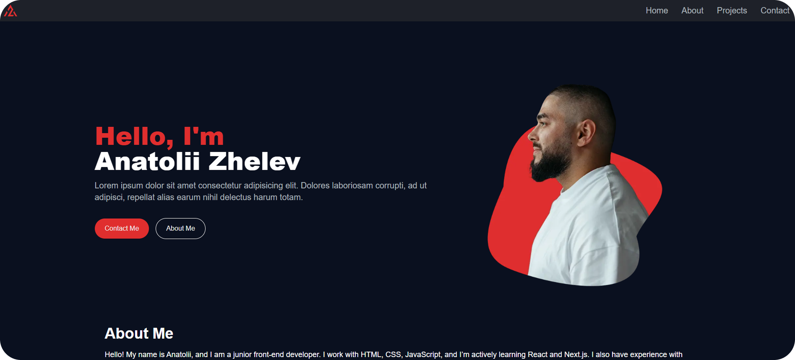

# Portfolio

## Description
This project is a personal portfolio that contains information about me, my projects, and skills. It is built using Next.js, Tailwind CSS, and Framer Motion to create a modern and interactive interface.

## Preview




## Technologies
- ⚛️ **Next.js** — A React framework for building server-side applications  
- 🎨 **Tailwind CSS** — A utility-first CSS framework for styling  
- 🎞️ **Framer Motion** — A motion library for React animations  
- ✉️ **Resend** — Email sending service used for contact forms and more

## Installation

To install the project, clone the repository and install dependencies:

```bash
git clone https://github.com/zhelev/portfolio-website.git
cd portfolio-website
npm install
```

After installation, run the development server:

```bash
npm run dev
```

## To be continue...
